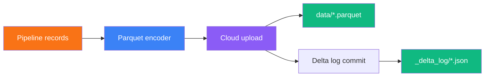

The **Delta Lake destination** writes standards-compliant Delta Lake tables to any supported cloud object storage. Each batch of records is encoded as Parquet, uploaded to your storage path, and committed as a new Delta Lake version — readable by Spark, Databricks, DuckDB, Trino, and every other Delta-compatible engine.

## Architecture



Every write is an **atomic commit**. The Delta transaction log records column schemas, file-level statistics (min/max/null counts), and version history so downstream consumers can perform time travel, predicate pushdown, and file skipping.

## Supported cloud providers

<Tabs>
  <Tab title="Amazon S3">
    | Field | Description |
    |-------|-------------|
    | **Credential** | AWS credential with `s3:PutObject`, `s3:GetObject`, `s3:DeleteObject`, and `s3:ListBucket` on the target bucket |
    | **Bucket** | S3 bucket name (e.g., `my-data-lake`) |
    | **Prefix** | Optional path prefix (e.g., `warehouse/sales/`) |
    | **Region** | AWS region (e.g., `us-east-1`, `us-west-2`) |
  </Tab>
  <Tab title="Google Cloud Storage">
    | Field | Description |
    |-------|-------------|
    | **Credential** | GCP service account with `storage.objects.create`, `storage.objects.get`, `storage.objects.delete` on the bucket |
    | **Bucket** | GCS bucket name |
    | **Prefix** | Optional object prefix |
  </Tab>
  <Tab title="Azure Blob Storage">
    | Field | Description |
    |-------|-------------|
    | **Credential** | Azure credential (connection string or service principal) with Blob Data Contributor role |
    | **Container** | Blob container name |
    | **Prefix** | Optional blob prefix |
    | **Storage Account** | Azure storage account name |
  </Tab>
</Tabs>

## Write modes

<Tabs>
  <Tab title="Append">
    Adds new Parquet files and a new Delta log version. Existing data remains untouched. Each pipeline run creates a new version number.

    **Best for:** event streams, logs, incremental loads, and any workload where historical data should not be modified.
  </Tab>
  <Tab title="Overwrite">
    Deletes all existing Parquet files and Delta logs at the table path, then writes fresh data as version 0.

    **Best for:** full-refresh dimension tables, snapshot replacements, and development/testing where you want a clean slate.

    <Warning>
      Overwrite permanently removes previous versions. If you need to preserve history, use Append mode with a partition strategy and downstream deduplication.
    </Warning>
  </Tab>
</Tabs>

## Schema evolution

When schema evolution is enabled, the destination adapts to upstream changes automatically:

<Steps>
  <Step title="First batch — type inference">
    Column types are inferred from the data: integers map to `long`, decimals to `double`, strings to `string`, booleans to `boolean`, and ISO-8601 timestamps to `timestamp`.
  </Step>
  <Step title="Subsequent batches — additive columns">
    If a new column appears in a later batch, it is appended to the Parquet schema and the Delta log. Existing columns retain their original types.
  </Step>
  <Step title="Type consistency">
    Once a column type is established in the first batch, it remains fixed for the life of the table. Mismatched types in later batches are coerced where safe or rejected with an error.
  </Step>
</Steps>

Supported Delta types: `string`, `long`, `double`, `boolean`, `timestamp`, `date`, `integer`, `short`, `byte`, `float`, `binary`.

## Column statistics

When statistics are enabled, every Parquet file commit includes metadata in the Delta log:

- **numRecords** — row count in the file
- **minValues** / **maxValues** — per-column extremes for numeric, string, date, and timestamp types
- **nullCount** — null values per column

Query engines use these statistics for **predicate pushdown** and **file skipping**, dramatically reducing scan times on large tables.

## Reading your tables

Once data lands, any Delta-compatible engine can query it immediately:

<CodeGroup>
```sql DuckDB
INSTALL delta;
LOAD delta;
SELECT * FROM delta_scan('s3://my-bucket/warehouse/sales/');
```

```python Spark / Databricks
df = spark.read.format("delta").load("s3://my-bucket/warehouse/sales/")
df.show()
```

```sql Trino
SELECT * FROM delta.default."s3://my-bucket/warehouse/sales/";
```
</CodeGroup>

## Performance benchmarks

Benchmarked on a standard Planasonix worker writing to S3 (us-west-2):

| Metric | Value |
|--------|-------|
| **Throughput** | ~167,000 rows/sec |
| **Compression** | Snappy |
| **Batch size** | 50,000 rows per Parquet file |
| **1M rows (5 columns)** | ~6 seconds, 33 MB on S3 |
| **Concurrency** | Thread-safe with atomic version numbering |

<Info>
  Throughput scales linearly with batch size. Larger batches produce fewer, larger Parquet files — ideal for analytical query patterns. Smaller batches (5,000–10,000) suit near-real-time use cases.
</Info>

## Troubleshooting

| Symptom | Likely cause | Fix |
|---------|-------------|-----|
| "Access denied" on upload | Cloud credential lacks write permission | Grant `PutObject` / `storage.objects.create` / Blob Data Contributor on the bucket and prefix |
| Version conflict error | Concurrent writers claiming the same version | Retry — the destination uses atomic versioning and will claim the next available number |
| Files exist but no `_delta_log/` | First write failed mid-commit | Re-run the pipeline; the next write creates version 0 from scratch |
| Query engine can't read table | Protocol version mismatch | Ensure your engine supports Delta reader version 1 and writer version 2 |
| Slow writes to S3 | Many small batches | Increase batch size to 50,000+ rows to reduce per-file overhead |

## Comparison with other lake destinations

| Feature | Delta Lake | Iceberg | Fabric / OneLake |
|---------|-----------|---------|------------------|
| **Cloud support** | S3, GCS, Azure | S3, GCS, Azure | OneLake only |
| **Table format** | Delta Lake | Apache Iceberg | Delta Lake |
| **SQL endpoint** | Via external engine | Via external catalog | Built-in Fabric SQL |
| **Write modes** | Append, Overwrite | Append, Overwrite, Merge | Append, Upsert, Replace |
| **Column statistics** | Yes | Yes | Yes |
| **Schema evolution** | Yes | Yes | Yes |
| **Cost** | Storage only | Storage only | Fabric capacity units |

## Related topics

<CardGroup cols={2}>
  <Card title="Data warehouses" icon="warehouse" href="/connections/data-warehouses">
    Warehouse connections for Snowflake, BigQuery, Databricks, Fabric, and more.
  </Card>
  <Card title="Destination nodes" icon="hard-drive-download" href="/nodes/destinations">
    Write modes, pre-flight checks, and other destination node types.
  </Card>
  <Card title="Cloud storage" icon="cloud" href="/connections/cloud-storage">
    Configure S3, GCS, and Azure Blob connections used by the Delta Lake destination.
  </Card>
  <Card title="Data contracts" icon="file-check" href="/governance/data-contracts">
    Enforce schema and quality rules before data lands in your lake.
  </Card>
</CardGroup>
