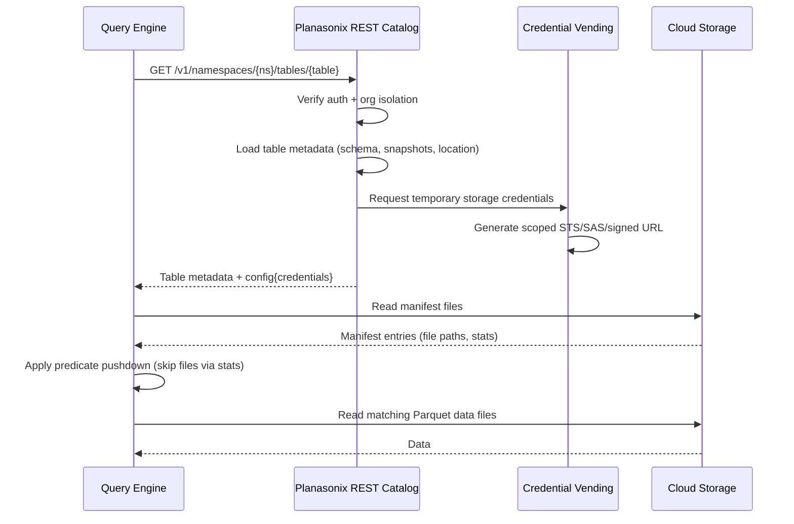

## Snowflake

Snowflake supports Iceberg tables through its [External Catalog Integration](https://docs.snowflake.com/en/sql-reference/sql/create-catalog-integration).

### Create Catalog Integration

```sql
CREATE OR REPLACE CATALOG INTEGRATION planasonix_catalog
  CATALOG_SOURCE = ICEBERG_REST
  TABLE_FORMAT = ICEBERG
  CATALOG_NAMESPACE = 'default'
  REST_CONFIG = (
    CATALOG_URI = 'https://api.planasonix.com/v1'
    WAREHOUSE = 'planasonix'
  )
  REST_AUTHENTICATION = (
    TYPE = BEARER
    BEARER_TOKEN = 'flx_your_api_key_here'
  )
  ENABLED = TRUE;
```

### Query Tables

```sql
SELECT * FROM planasonix_catalog.default.my_table LIMIT 10;
```

<Note>
  Snowflake's Iceberg REST support is in preview. Check Snowflake's documentation for the latest syntax and availability.
</Note>

---

## DuckDB

DuckDB connects via its built-in `iceberg` extension.

### Install Extension

```sql
INSTALL iceberg;
LOAD iceberg;
```

### Attach Catalog

```sql
ATTACH 'https://api.planasonix.com/v1' AS planasonix (
  TYPE ICEBERG,
  BEARER_TOKEN 'flx_your_api_key_here'
);
```

### Query Tables

```sql
SELECT * FROM planasonix.default.my_table LIMIT 10;
```

<Tip>
  DuckDB works well for local development and ad-hoc queries. It reads Parquet data files directly from cloud storage using the vended credentials.
</Tip>

---

## Apache Spark

Spark connects through the `org.apache.iceberg.spark.SparkCatalog` class.

### Spark Configuration

```python
spark = SparkSession.builder \
    .config("spark.sql.catalog.planasonix", "org.apache.iceberg.spark.SparkCatalog") \
    .config("spark.sql.catalog.planasonix.type", "rest") \
    .config("spark.sql.catalog.planasonix.uri", "https://api.planasonix.com/v1") \
    .config("spark.sql.catalog.planasonix.credential", "flx_your_api_key_here") \
    .config("spark.sql.catalog.planasonix.warehouse", "planasonix") \
    .getOrCreate()
```

### Query Tables

```python
df = spark.read.table("planasonix.default.my_table")
df.show()
```

### spark-defaults.conf

```properties
spark.sql.catalog.planasonix=org.apache.iceberg.spark.SparkCatalog
spark.sql.catalog.planasonix.type=rest
spark.sql.catalog.planasonix.uri=https://api.planasonix.com/v1
spark.sql.catalog.planasonix.credential=flx_your_api_key_here
spark.sql.catalog.planasonix.warehouse=planasonix
```

<Note>
  Spark uses the Iceberg REST spec's OAuth2 token exchange (`POST /v1/oauth/tokens`) automatically when `credential` is set.
</Note>

---

## Trino

Trino connects via the [Iceberg connector](https://trino.io/docs/current/connector/iceberg.html) with REST catalog type.

### Catalog Properties

Create `etc/catalog/planasonix.properties`:

```properties
connector.name=iceberg
iceberg.catalog.type=rest
iceberg.rest-catalog.uri=https://api.planasonix.com/v1
iceberg.rest-catalog.security=OAUTH2
iceberg.rest-catalog.oauth2.credential=flx_your_api_key_here
iceberg.rest-catalog.warehouse=planasonix
```

### Query Tables

```sql
SELECT * FROM planasonix.default.my_table LIMIT 10;
```

<Tip>
  Trino can push down predicates and projections to the Iceberg metadata layer, making it efficient for large-scale analytical queries.
</Tip>

---

## How `loadTable` Works

When a query engine connects to the Planasonix catalog and loads a table, the following flow occurs:



Key points:

- **Credential vending** is automatic — the catalog generates short-lived, read-only credentials scoped to the table's storage path
- **Predicate pushdown** uses Iceberg manifest statistics (min/max per column) to skip files before downloading them
- Credentials are valid for **1 hour** (AWS STS) or the SAS token duration (Azure)

---

## Troubleshooting

<AccordionGroup>
  <Accordion title="401 Unauthorized">
    - Verify your `flx_` API key is valid and active
    - Ensure the key belongs to an organization on a tier with Hosted Catalog enabled (Professional or above)
    - Check that the `Authorization` header uses `Bearer` prefix
  </Accordion>
  <Accordion title="403 Feature Not Available">
    - The Hosted Catalog feature is only available on Professional tier and above
    - Upgrade your plan or contact support
  </Accordion>
  <Accordion title="404 Namespace / Table Not Found">
    - Verify the namespace and table names are correct
    - Ensure the pipeline has run at least once to auto-register tables
    - Check you're querying the correct organization's catalog
  </Accordion>
  <Accordion title="Credential vending returns empty config">
    - Verify the Managed Lakehouse connection has valid cloud credentials configured
    - Check that the credential ID referenced by the table still exists
  </Accordion>
  <Accordion title="DuckDB can't read data files">
    - Ensure the DuckDB `iceberg` extension is installed and loaded
    - Vended credentials are short-lived; if expired, re-query the table to get fresh credentials
  </Accordion>
</AccordionGroup>
