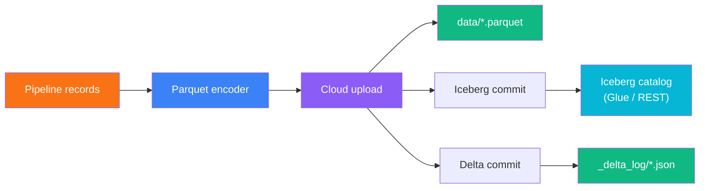

The **Managed Lakehouse** destination writes Parquet data files once and commits metadata to both Apache Iceberg and Delta Lake in a single atomic operation. Every query engine in your stack — whether it speaks Iceberg or Delta — can read the same underlying data without conversion or duplication.

<Info>
  Managed Lakehouse is available on the **Professional** plan and above. [Upgrade →](/settings/billing)
</Info>

## Architecture



**Key design decisions:**

1. **Single write, dual commit** — Parquet files are uploaded once. Iceberg and Delta metadata are committed separately, eliminating data duplication.
2. **Iceberg-primary** — Iceberg is the transactional source of truth. If the Iceberg commit succeeds but Delta fails, the pipeline retries Delta once and logs a warning without failing the run.
3. **Catalog-backed** — Iceberg tables are registered in a catalog (AWS Glue Data Catalog or REST Catalog) for schema governance, time travel, and partition pruning.

## Supported cloud providers

<Tabs>
  <Tab title="Amazon S3">
    | Field | Description |
    |-------|-------------|
    | **Credential** | AWS credential with `s3:PutObject`, `s3:GetObject`, `s3:DeleteObject`, `s3:ListBucket` on the target bucket |
    | **Bucket** | S3 bucket name (e.g., `my-data-lake`) |
    | **Prefix** | Path prefix for data files (e.g., `lakehouse/`) |
    | **Region** | AWS region (e.g., `us-west-2`) |

    For Iceberg via AWS Glue, the credential also needs:
    - `glue:GetDatabase`, `glue:GetDatabases`
    - `glue:GetTable`, `glue:GetTables`, `glue:CreateTable`, `glue:UpdateTable`
  </Tab>
  <Tab title="Google Cloud Storage">
    | Field | Description |
    |-------|-------------|
    | **Credential** | GCP service account with `storage.objects.create`, `storage.objects.get`, `storage.objects.delete` |
    | **Bucket** | GCS bucket name |
    | **Prefix** | Optional object prefix |
  </Tab>
  <Tab title="Azure Blob Storage">
    | Field | Description |
    |-------|-------------|
    | **Credential** | Azure credential (storage key, connection string, or service principal) with Blob Data Contributor role |
    | **Container** | Blob container name |
    | **Prefix** | Optional blob prefix |
    | **Storage Account** | Azure storage account name |
  </Tab>
</Tabs>

## Iceberg catalog configuration

<Tabs>
  <Tab title="AWS Glue Catalog">
    | Field | Description |
    |-------|-------------|
    | **Catalog Type** | `glue` |
    | **Region** | AWS region of the Glue Data Catalog |
    | **Namespace** | Glue database name (e.g., `analytics`) |
    | **Warehouse** | S3 path for Iceberg data files (e.g., `s3://my-bucket/lakehouse/`) |

    AWS credentials are shared with the S3 storage credential. Glue permissions must include table create/update access.
  </Tab>
  <Tab title="REST Catalog">
    | Field | Description |
    |-------|-------------|
    | **Catalog Type** | `rest` |
    | **Catalog URL** | REST catalog endpoint (e.g., `https://iceberg-catalog.example.com`) |
    | **Token** | Bearer token or API key for authentication |
    | **Namespace** | Catalog namespace or database |
    | **Warehouse** | Warehouse identifier or storage path |

    REST catalogs are compatible with Tabular, Nessie, Polaris, and other Iceberg REST catalog implementations.
  </Tab>
</Tabs>

## Write modes

<Tabs>
  <Tab title="Append">
    Adds new Parquet files and commits a new snapshot to both Iceberg and Delta. Existing data is preserved.

    **Best for:** event streams, logs, incremental loads, and any workload where historical data should not be modified.
  </Tab>
  <Tab title="Overwrite">
    Replaces all existing data with a new snapshot. In Iceberg, this creates an overwrite snapshot. In Delta, existing files are removed and a new version 0 is committed.

    **Best for:** full-refresh dimension tables, snapshot replacements, and development/testing.

    <Warning>
      Overwrite removes previous data from the active snapshot. Iceberg retains previous snapshots for time travel (governed by snapshot retention settings).
    </Warning>
  </Tab>
  <Tab title="Merge (Upsert)">
    Appends data with merge-on-read semantics using the configured key columns. Downstream query engines resolve duplicates at read time using the primary key.

    **Best for:** slowly changing dimensions, customer records, and any dataset with a natural primary key that receives updates.

    <Info>
      Set one or more **Key Columns** to enable merge mode. Records with matching keys in subsequent batches are treated as updates.
    </Info>
  </Tab>
</Tabs>

## Table formats

You can enable one or both formats:

| Format | Description | When to use |
|--------|-------------|-------------|
| **Apache Iceberg** | Catalog-backed, ACID-transactional table format with time travel, schema evolution, and hidden partitioning | Primary format for analytics engines (Spark, Trino, Athena, Flink) |
| **Delta Lake** | File-based transaction log with column statistics | When you also need Databricks/DuckDB compatibility or dual-engine access |

By default, both formats are enabled. If you only need one, uncheck the other in the node configuration.

## Advanced settings

### Partition strategy

Partitioning organizes data files by column values for faster queries. Supported partition transforms:

| Transform | Syntax | Example |
|-----------|--------|---------|
| Identity | `column_name` | `region` |
| Year | `year(column)` | `year(created_at)` |
| Month | `month(column)` | `month(created_at)` |
| Day | `day(column)` | `day(created_at)` |
| Hour | `hour(column)` | `hour(event_time)` |
| Bucket | `bucket(n, column)` | `bucket(16, user_id)` |
| Truncate | `truncate(w, column)` | `truncate(4, zip_code)` |

### Schema evolution

When enabled (default), the destination automatically adapts to upstream schema changes:

<Steps>
  <Step title="First batch — schema inference">
    Column types are inferred from the data and registered in both the Iceberg catalog and Delta log.
  </Step>
  <Step title="New columns">
    If a new column appears in a later batch, it is added to the schema. Existing columns retain their original types.
  </Step>
  <Step title="Iceberg schema IDs">
    Iceberg tracks column identity by field ID, enabling safe renames and reordering without breaking downstream consumers.
  </Step>
</Steps>

### Maintenance settings

| Setting | Default | Description |
|---------|---------|-------------|
| **Snapshot Retention** | 7 days | How long to keep expired Iceberg snapshots and Delta versions before cleanup |
| **Compaction Target** | 128 MB | Target file size for compaction operations — smaller values produce more files but faster writes |

Maintenance can be triggered manually via the API or scheduled automatically.

## Reading your tables

<CodeGroup>
```sql Iceberg — Spark
SELECT * FROM glue_catalog.analytics.events;
```

```sql Iceberg — Trino
SELECT * FROM iceberg.analytics.events;
```

```sql Delta — DuckDB
INSTALL delta;
LOAD delta;
SELECT * FROM delta_scan('s3://my-bucket/lakehouse/analytics/events');
```

```python Iceberg — PyIceberg
from pyiceberg.catalog import load_catalog
catalog = load_catalog("glue", **{"type": "glue", "glue.region": "us-west-2"})
table = catalog.load_table("analytics.events")
df = table.scan().to_pandas()
```
</CodeGroup>

## API reference

The Managed Lakehouse API provides endpoints for table management, commit history, and maintenance operations.

### List registered tables

```bash
GET /api/managed-lakehouse/tables
```

### Register a new table

```bash
POST /api/managed-lakehouse/tables
Content-Type: application/json

{
  "connectionId": "uuid",
  "tableName": "events",
  "storageProvider": "s3",
  "storagePath": "s3://my-bucket/lakehouse/events",
  "icebergEnabled": true,
  "deltaEnabled": true,
  "icebergCatalogType": "glue",
  "icebergNamespace": "analytics"
}
```

### View commit history

```bash
GET /api/managed-lakehouse/tables/{tableId}/commits?limit=50
```

### Trigger maintenance

```bash
POST /api/managed-lakehouse/tables/{tableId}/maintenance
Content-Type: application/json

{
  "operation": "full_maintenance"
}
```

Available operations: `snapshot_expiry`, `orphan_cleanup`, `compaction`, `metadata_cleanup`, `delta_checkpoint`, `full_maintenance`.

## Troubleshooting

| Symptom | Likely cause | Fix |
|---------|-------------|-----|
| "Iceberg catalog not found" | Glue database doesn't exist or wrong region | Create the Glue database first; verify the region matches your bucket |
| "io scheme not registered" | Missing S3/GCS I/O driver | This is an internal error — contact support |
| "PermanentRedirect" on S3 | Region mismatch between bucket and Glue | Ensure the bucket region and Glue catalog region are the same |
| Delta commit failed, Iceberg succeeded | Transient storage error | The destination retries Delta once automatically. Check S3 permissions. |
| "Access denied" on Glue | IAM credential lacks Glue permissions | Add `glue:CreateTable`, `glue:UpdateTable`, `glue:GetTable` to the IAM policy |
| Table visible in Iceberg but not Delta | Only Iceberg format enabled | Check the format selection — enable Delta in the node configuration |
| Slow writes | Many small batches | Increase pipeline batch size to 10,000+ rows |

## Comparison with other destinations

| Feature | Managed Lakehouse | Delta Lake | Iceberg | Fabric / OneLake |
|---------|------------------|-----------|---------|------------------|
| **Formats** | Iceberg + Delta | Delta only | Iceberg only | Delta only |
| **Cloud support** | S3, GCS, Azure | S3, GCS, Azure | S3, GCS, Azure | OneLake only |
| **Catalog** | Glue, REST | None (file-based) | Glue, REST | Fabric |
| **Write modes** | Append, Overwrite, Merge | Append, Overwrite | Append, Overwrite, Merge | Append, Upsert |
| **Time travel** | Yes (Iceberg snapshots) | Yes (Delta versions) | Yes | Yes |
| **Schema evolution** | Yes | Yes | Yes | Yes |
| **Dual-engine access** | Yes | Delta engines only | Iceberg engines only | Fabric only |
| **Tier** | Professional+ | All tiers | Professional+ | All tiers |

## Related topics

<CardGroup cols={2}>
  <Card title="Delta Lake destination" icon="triangle" href="/connections/delta-lake">
    Standalone Delta Lake destination for simpler single-format workflows.
  </Card>
  <Card title="Destination nodes" icon="hard-drive-download" href="/nodes/destinations">
    All destination node types including Write, Cloud Destination, and Iceberg.
  </Card>
  <Card title="Cloud storage" icon="cloud" href="/connections/cloud-storage">
    Configure S3, GCS, and Azure Blob connections used by the lakehouse.
  </Card>
  <Card title="Data contracts" icon="file-check" href="/governance/data-contracts">
    Enforce schema and quality rules before data lands in your lakehouse.
  </Card>
</CardGroup>
