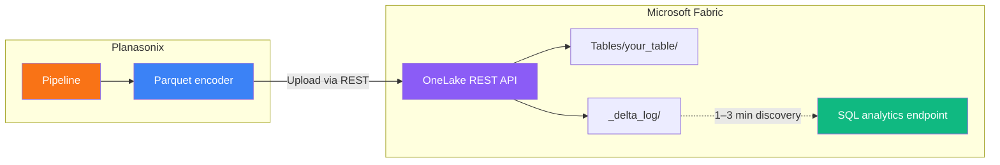

The **OneLake destination** writes data to Microsoft Fabric Lakehouses and Warehouses. It authenticates via a Service Principal, uploads Parquet files to OneLake storage, and commits Delta Lake transaction logs so data is immediately queryable through Fabric's SQL analytics endpoint.

## Architecture

### Write path by item type

| Item Type | Write Path | SQL Endpoint |
|-----------|-----------|--------------|
| **Lakehouse** | OneLake REST API → Delta Lake (Parquet + transaction log) | Read-only SQL analytics endpoint (1–3 min discovery lag) |
| **Warehouse** | TDS protocol → SQL bulk insert via service principal SQL token | Read-write SQL endpoint (immediate) |

<Info>
  Fabric Lakehouses expose a **read-only** SQL analytics endpoint. DDL operations (CREATE TABLE, ALTER TABLE) are not supported via SQL. The OneLake destination automatically detects this and uses the Delta Lake write path instead.
</Info>

## Prerequisites

Before creating the connection, set up a Service Principal in Azure:

<Steps>
  <Step title="Register an application">
    In the **Azure Portal**, navigate to **Microsoft Entra ID → App registrations → New registration**. Name it (e.g., `planasonix-onelake`) and register.
  </Step>
  <Step title="Create a client secret">
    Under **Certificates & secrets → New client secret**, create a secret and **copy the Value immediately** — it is only shown once. Note the expiration date.
  </Step>
  <Step title="Copy identifiers">
    From the app registration **Overview** page, copy the **Application (client) ID** and **Directory (tenant) ID**.
  </Step>
  <Step title="Enable Fabric API access">
    In the **Fabric Admin Portal → Tenant settings**, enable **"Service principals can use Fabric APIs"** for your security group or the entire organization.
  </Step>
  <Step title="Grant workspace access">
    In your **Fabric Workspace**, click **Manage access** and add the service principal as a **Contributor** or **Member**. This grants write access to OneLake storage.
  </Step>
  <Step title="Find workspace and item IDs">
    Open your Lakehouse or Warehouse in the Fabric portal. The URL contains both IDs:

    `https://app.fabric.microsoft.com/groups/{workspaceId}/lakehouses/{itemId}`
  </Step>
</Steps>

## Connection fields

| Field | Required | Description |
|-------|----------|-------------|
| **Tenant ID** | Yes | Microsoft Entra ID (Azure AD) tenant GUID |
| **Client ID** | Yes | Application (client) ID of the service principal |
| **Client Secret** | Yes | Client secret value (not the secret ID) |
| **Workspace ID** | Yes | Fabric workspace GUID |
| **Item ID** | Yes | Lakehouse or Warehouse item GUID |
| **Item Type** | Yes | `lakehouse` or `warehouse` |

<Warning>
  Client secrets expire. Set a calendar reminder to rotate them before expiration. An expired secret silently breaks all pipelines using the connection.
</Warning>

## Write modes

<Tabs>
  <Tab title="Append">
    New Parquet files and Delta log versions are added without modifying existing data. Each pipeline run produces a new version number.

    **Best for:** incremental loads, event streams, CDC pipelines.
  </Tab>
  <Tab title="Upsert">
    Inserts new rows and updates existing rows based on **key columns**. Uses SQL MERGE semantics when the SQL endpoint supports it, or Delta-level append for Lakehouses.

    **Best for:** dimension tables, slowly changing dimensions (SCD Type 1).
  </Tab>
  <Tab title="Replace">
    Deletes all existing data at the table path, then writes a fresh Delta table as version 0.

    **Best for:** full-refresh snapshots, lookup tables, development/testing.
  </Tab>
  <Tab title="Insert">
    Appends rows. Fails on unique key violations if the target enforces constraints.

    **Best for:** append-only fact tables with surrogate keys.
  </Tab>
</Tabs>

## Schema management

- Column types are **inferred automatically** from the first batch
- Types are cached and reused for all subsequent batches in the same run
- When **auto schema migration** is enabled, new columns in later batches trigger schema expansion
- Supported types: `string`, `long`, `double`, `boolean`, `timestamp`, `date`

## Performance considerations

| Factor | Lakehouse | Warehouse |
|--------|-----------|-----------|
| **Write latency** | Low (direct OneLake upload) | Low (SQL bulk insert) |
| **SQL visibility** | 1–3 min after write (endpoint discovery) | Immediate |
| **DDL support** | Delta Lake only (no SQL DDL) | Full SQL DDL |
| **Optimal batch size** | 10,000–50,000 rows | 10,000–50,000 rows |

<Info>
  The 1–3 minute SQL endpoint discovery delay is a Microsoft Fabric limitation. Data is physically present in OneLake immediately after the write — it just takes time for the SQL analytics endpoint to index the new Delta log version.
</Info>

## Troubleshooting

| Symptom | Likely cause | Fix |
|---------|-------------|-----|
| "Authentication failed" | Invalid or expired credentials | Verify tenant ID, client ID, and client secret in the Azure portal |
| "Workspace not found" | Incorrect workspace ID | Copy the workspace GUID from the Fabric portal URL |
| "Table not visible in SQL" | Fabric discovery lag | Wait 1–3 minutes; data is already in OneLake storage |
| "SQL DDL blocked" | Lakehouse read-only endpoint | Expected behavior — the destination uses Delta Lake writes automatically |
| "Upload failed to OneLake" | Missing workspace permissions | Grant the service principal Contributor role on the workspace |
| "Item not found" | Wrong item ID or item type | Verify the item GUID and that `itemType` matches (lakehouse vs warehouse) |

## OneLake vs Fabric connector

The OneLake destination is **functionally identical** to the existing Fabric connector for write operations. It exists as a separate connection type to support independent configuration, future OneLake-specific optimizations, and clearer naming for OneLake-focused data engineering workflows.

| Aspect | OneLake Destination | Fabric Connector |
|--------|-------------------|-----------------|
| Authentication | Service principal | Service principal |
| Write path (Lakehouse) | OneLake REST → Delta Lake | OneLake REST → Delta Lake |
| Write path (Warehouse) | TDS → SQL bulk insert | TDS → SQL bulk insert |
| Configuration | Separate connection | Separate connection |
| Use when | Building new OneLake pipelines | Maintaining existing Fabric pipelines |

## Related topics

<CardGroup cols={2}>
  <Card title="Data warehouses" icon="warehouse" href="/connections/data-warehouses">
    Overview of all warehouse and lakehouse connections.
  </Card>
  <Card title="Delta Lake destination" icon="triangle" href="/connections/delta-lake">
    Cloud-agnostic Delta Lake writes to S3, GCS, or Azure Blob.
  </Card>
  <Card title="Credentials" icon="key-round" href="/connections/credentials">
    Securely store and rotate service principal secrets.
  </Card>
  <Card title="Destination nodes" icon="hard-drive-download" href="/nodes/destinations">
    Write modes, pre-flight checks, and all destination node types.
  </Card>
</CardGroup>

