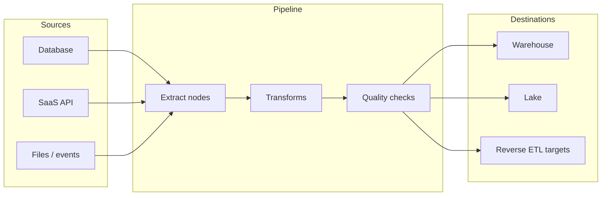

Planasonix is an enterprise-grade ETL and ELT platform. You connect sources of record to analytics and operations systems, define how data should be shaped along the way, and run those flows on a schedule, on demand, or continuously when the source supports change data capture.

Organizations adopt Planasonix when spreadsheet exports and one-off scripts no longer scale: you need repeatable pipelines, shared connections, reviewable changes, and clear ownership when something breaks.

## What you can do with Planasonix

- **Connect broadly** — Choose from 300+ connectors spanning databases, data warehouses, lakes, event buses, SaaS APIs, and file stores. You store credentials once per workspace and reference them from many pipelines.
- **Design visually** — Use the pipeline canvas to wire **nodes** together: extract from a source, join and aggregate in transforms, validate quality gates, and load to one or more destinations. The graph is versioned so you can compare edits and roll back.
- **Run reverse ETL** — Take modeled tables from your warehouse and sync segments, features, and KPIs into tools sales, marketing, and support already use, with field-level mapping and sync windows you control.
- **Work with an AI copilot** — Ask for help in natural language to draft SQL, propose column mappings, explain an error log, or summarize what a pipeline did on its last run, grounded in metadata you have permission to see.
- **Stream and capture changes** — In addition to batch loads, you run low-latency pipelines that consume CDC or streaming sources so dashboards and downstream systems reflect new data within minutes or seconds.
- **Govern access** — Organize work into **organizations** and **projects**, assign roles, classify datasets, and retain audit history for who changed what and when.
- **Orchestrate reliably** — Attach **schedules**, define dependencies between pipelines, configure retries and SLAs, and coordinate backfills without overwriting production tables blindly.

## ETL, ELT, and reverse ETL

<Tabs>
  <Tab title="ETL">
    You transform data in-flight before it lands in the destination. Use this when you want the warehouse to receive cleaned, conformed tables and to limit what you store.
  </Tab>
  <Tab title="ELT">
    You load raw or lightly typed data first, then transform inside the warehouse using dbt, SQL, or Planasonix transform nodes. Use this when you want analysts to explore source fidelity or when the warehouse is the primary place for heavy joins.
  </Tab>
  <Tab title="Reverse ETL">
    You read from the warehouse (or semantic layer) and write to operational systems. Use this when modeled metrics and segments should appear in CRMs, ad platforms, or in-app experiences.
  </Tab>
</Tabs>

## How a pipeline is structured

Data flows in one direction through a **pipeline**: from **sources**, through **transforms** and optional **quality** steps, to **destinations**. A single pipeline can fan out to multiple targets or merge several inputs before you write results.

You do not need every stage on every pipeline. A minimal flow might be one extract node and one load node; a complex flow might branch after validation to send bad rows to a quarantine table while good rows continue to the warehouse.

## Who Planasonix is for

- **Data engineers** who own ingestion, modeling handoffs, and production stability.
- **Analytics engineers** who want a governed place to schedule loads and reverse ETL without maintaining bespoke orchestration.
- **Platform teams** who standardize connectors, secrets, and observability across business units.

## What's next

<Card title="Quickstart" icon="timer" href="/getting-started/quickstart">
  Create an account, add a connection, build a small pipeline, and watch the first run complete—then open run history to verify row counts and logs.
</Card>

If you prefer concepts before clicking through the product, read [Core concepts](/getting-started/concepts) for definitions of organizations, projects, connections, pipelines, nodes, schedules, and reverse ETL syncs.
