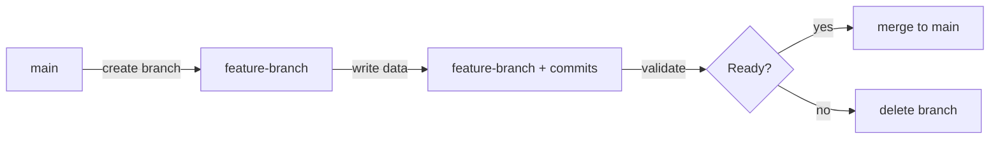

## Overview

Branches let you write data to an isolated copy of your table without affecting the main data. Tags are immutable bookmarks on specific snapshots.

## Branches

### Use Cases

- **Safe testing**: Test new transforms on a branch before merging to production
- **A/B experimentation**: Write different data processing paths to separate branches
- **Staging**: Use a branch as a staging environment before promoting to main

### Branch Lifecycle



### API

<AccordionGroup>
  <Accordion title="List branches">
    ```
    GET /api/managed-lakehouse/tables/{tableId}/branches
    ```
  </Accordion>

  <Accordion title="Create branch">
    ```
    POST /api/managed-lakehouse/tables/{tableId}/branches
    ```
    ```json
    {
      "branchName": "experiment-v2",
      "snapshotId": 123456  // optional, defaults to current
    }
    ```
  </Accordion>

  <Accordion title="Merge branch">
    ```
    POST /api/managed-lakehouse/tables/{tableId}/branches/{name}/merge
    ```
    Fast-forward merge: updates main's snapshot pointer to the branch head.
  </Accordion>

  <Accordion title="Delete branch">
    ```
    DELETE /api/managed-lakehouse/tables/{tableId}/branches/{name}
    ```
    The `main` branch cannot be deleted.
  </Accordion>
</AccordionGroup>

### Pipeline Configuration

Set the **Write to Branch** field in the Managed Lakehouse destination node to direct writes to a named branch:

```json
{
  "managedLakehouseSettings": {
    "writeBranch": "staging-branch"
  }
}
```

## Tags

Tags are immutable bookmarks on specific snapshots.

### Use Cases

- **Release markers**: `production-2026-Q1`
- **Compliance checkpoints**: Mark snapshots for audit retention
- **Rollback targets**: Know exactly which snapshot to revert to

### API

<AccordionGroup>
  <Accordion title="List tags">
    ```
    GET /api/managed-lakehouse/tables/{tableId}/tags
    ```
  </Accordion>

  <Accordion title="Create tag">
    ```
    POST /api/managed-lakehouse/tables/{tableId}/tags
    ```
    ```json
    {
      "tagName": "production-2026-Q1",
      "snapshotId": 123456,
      "note": "End of Q1 data freeze"
    }
    ```
  </Accordion>

  <Accordion title="Delete tag">
    ```
    DELETE /api/managed-lakehouse/tables/{tableId}/tags/{name}
    ```
  </Accordion>
</AccordionGroup>

## Tier Limits

| | Professional | Premium | Enterprise |
|---|---|---|---|
| Branches per table | 2 | 10 | Unlimited |
| Tags per table | 5 | 25 | Unlimited |
