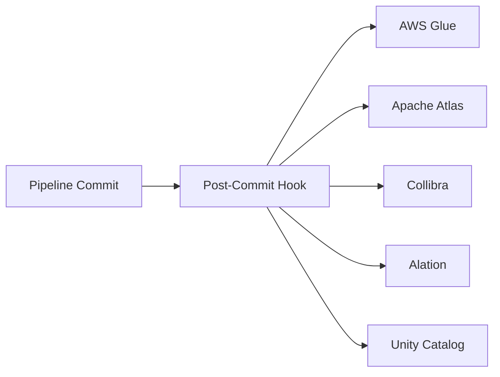

## Overview

Multi-Catalog Sync pushes table metadata from your Managed Lakehouse to external catalog systems after each commit. This keeps external discovery tools — AWS Glue, Apache Atlas, Collibra, Alation, and Databricks Unity Catalog — in sync without manual registration.



## Supported Catalogs

| Catalog | What's Synced | Auth |
|---|---|---|
| **AWS Glue** | Database, table, schema, partition spec, location | IAM role / access keys |
| **Apache Atlas** | Entity, schema, lineage, classifications | Kerberos / basic auth |
| **Collibra** | Asset, schema, attributes, domain mapping | API key |
| **Alation** | Data source, schema, table, column descriptions | API token |
| **Unity Catalog** | Catalog, schema, table, storage location | Service principal |

## Configuration

### Add a Sync Target

In the Table Explorer, navigate to the **Catalog Sync** tab:

<Steps>
  <Step title="Click Add Catalog Target">
    Select the catalog type from the dropdown (Glue, Atlas, Collibra, Alation, Unity).
  </Step>
  <Step title="Name the target">
    Give it a descriptive name, e.g., `production-glue` or `analytics-atlas`.
  </Step>
  <Step title="Provide credentials">
    Enter the connection details specific to the catalog type (IAM role, API key, service principal, etc.).
  </Step>
  <Step title="Enable">
    Toggle the target to active. Metadata will sync on the next pipeline commit.
  </Step>
</Steps>

### API Configuration

```
POST /api/managed-lakehouse/tables/{tableId}/catalog-targets
```

```json
{
  "catalogType": "glue",
  "catalogName": "production-glue",
  "config": {
    "region": "us-east-1",
    "database": "analytics",
    "roleArn": "arn:aws:iam::123456789012:role/GlueSyncRole"
  },
  "enabled": true
}
```

### List Targets

```
GET /api/managed-lakehouse/tables/{tableId}/catalog-targets
```

### Remove a Target

```
DELETE /api/managed-lakehouse/tables/{tableId}/catalog-targets/{targetId}
```

## Sync Behavior

After every successful commit to a managed lakehouse table, the post-commit hook:

1. Retrieves the list of enabled catalog targets for the table
2. Builds a metadata payload (table name, schema, location, partition spec, snapshot ID)
3. Sends the payload to each target in parallel
4. Records sync status per target: `synced`, `failed`, or `pending`

### Monitoring Sync Status

Each catalog target shows its last sync status in the Table Explorer:

| Status | Meaning |
|---|---|
| `synced` | Last commit was successfully synced |
| `pending` | Sync has not yet run |
| `failed` | Last sync attempt failed — check error details |

Failed syncs include an error message. The next pipeline commit retries the sync automatically.

## Tier Availability

| Tier | Catalog Targets per Table |
|---|---|
| Professional | — |
| Premium | 2 |
| Enterprise | Unlimited |

## Related

<CardGroup cols={2}>
  <Card title="Hosted Iceberg Catalog" icon="database" href="/connections/iceberg-catalog">
    The built-in catalog for direct query engine access
  </Card>
  <Card title="Data Catalog" icon="books" href="/governance/data-catalog">
    Planasonix's internal data catalog for discovery
  </Card>
</CardGroup>

