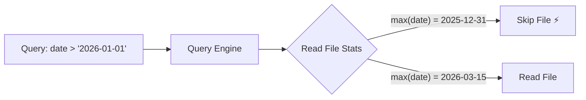

## Overview

Column statistics are automatically computed during every Parquet write and stored in both Iceberg snapshot properties and Delta Lake `add` action metadata. Query engines use these statistics for **predicate pushdown** — skipping entire data files that cannot contain matching rows.

## What's Computed

| Statistic | Description | Storage |
|---|---|---|
| **Min value** | Smallest value in the column | Iceberg manifest + Delta stats JSON |
| **Max value** | Largest value in the column | Iceberg manifest + Delta stats JSON |
| **Null count** | Number of null values | Iceberg manifest + Delta stats JSON |
| **Distinct estimate** | Approximate unique values | Iceberg snapshot properties |

## How It Improves Query Performance



When a query engine reads an Iceberg table or Delta table, it checks the per-file column statistics **before** downloading data files. If a file's max value for `date` is `2025-12-31`, any query filtering `date > 2026-01-01` skips the file entirely. This can reduce I/O by **90%+** for selective queries.

## Viewing Column Stats

Navigate to **Managed Lakehouse** → select a table → **Column Stats** tab.

The Column Stats panel displays:

| Column | Type | Min | Max | Nulls | Distinct |
|---|---|---|---|---|---|
| `user_id` | int64 | 1 | 982,451 | 0 | 245,112 |
| `event_type` | string | `click` | `view` | 12 | 8 |
| `created_at` | timestamp | 2025-01-01 | 2026-04-09 | 0 | 456,321 |
| `amount` | float64 | 0.01 | 9,999.99 | 1,203 | 8,742 |

## API

```
GET /api/managed-lakehouse/tables/{tableId}/column-stats
```

### Response

```json
{
  "columns": [
    {
      "name": "user_id",
      "type": "int64",
      "min": "1",
      "max": "982451",
      "nullCount": 0,
      "distinctEstimate": 245112
    }
  ],
  "snapshotId": 7834921,
  "computedAt": "2026-04-09T14:30:00Z"
}
```

## Thresholds

<Info>
Tables with more than **200 columns** only compute statistics for primary keys, partition columns, sort columns, and system columns to keep commit latency low.
</Info>

| Table Width | Columns Profiled |
|---|---|
| ≤ 200 columns | All columns |
| > 200 columns | Keys, partition, sort, and system columns only |

## Storage Details

### Iceberg

Statistics are stored as snapshot-level properties with keys:

```
planasonix.stats.<column>.min
planasonix.stats.<column>.max
planasonix.stats.<column>.null_count
planasonix.stats.<column>.distinct_count
```

### Delta Lake

Statistics are embedded in the `stats` JSON field of each `add` action in the transaction log:

```json
{
  "numRecords": 50000,
  "minValues": { "user_id": 1, "amount": 0.01 },
  "maxValues": { "user_id": 982451, "amount": 9999.99 },
  "nullCount": { "user_id": 0, "amount": 1203 }
}
```

## Best Practices

<CardGroup cols={2}>
  <Card title="Use with Z-Order" icon="table-cells">
    Z-ordered data has tighter min/max ranges per file, making statistics-based pruning even more effective.
  </Card>
  <Card title="Compact regularly" icon="compress">
    Compaction recalculates statistics across merged files for up-to-date min/max bounds.
  </Card>
</CardGroup>

## Related

<CardGroup cols={2}>
  <Card title="Z-Order Sort" icon="arrow-up-arrow-down" href="/managed-lakehouse/z-order-sort">
    Improve data locality for multi-column queries
  </Card>
  <Card title="Table Maintenance" icon="wrench" href="/managed-lakehouse/table-maintenance">
    Compaction refreshes column statistics automatically
  </Card>
</CardGroup>
