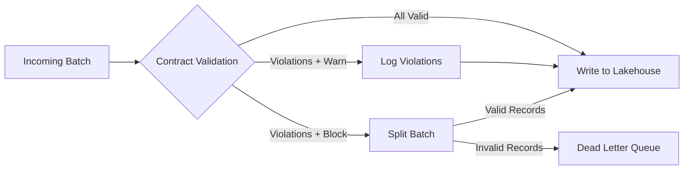

## Overview

Work Stream 5 adds two capabilities to the Managed Lakehouse destination:

1. **Data Contract Enforcement** — validate every record against a data contract before writing to Iceberg/Delta
2. **Partition Advisor** — analyze column profiles and recommend optimal partition strategies

## Data Contract Enforcement

When a data contract is assigned to a Managed Lakehouse node, every batch of records is validated before being written to cloud storage.

### Enforcement Modes

| Mode | Behavior | Invalid Records |
|------|----------|----------------|
| **Warn** | Log violations, write all data | Written normally |
| **Block** | Reject invalid records | Routed to Dead Letter Queue |

### How It Works



### Configuration

In the pipeline canvas, open the Managed Lakehouse node settings:

1. Expand **Advanced Settings**
2. Under **Data Contract Enforcement**, select a contract
3. Choose enforcement mode: **Warn** or **Block**

### API Configuration

Contracts are configured as part of the managed lakehouse node settings:

```json
{
  "managedLakehouseSettings": {
    "connectionId": "conn-123",
    "tableName": "events",
    "writeMode": "append",
    "formats": ["iceberg", "delta"],
    "contractId": "contract-456",
    "contractMode": "block"
  }
}
```

### Viewing Violations

Contract violations are recorded in the **Data Contracts** page under the contract's violation history. Each violation includes:

- The pipeline run ID
- Affected column and violation type
- Expected vs actual values
- Sample data

In **block** mode, rejected records appear in the **DLQ** page with error code `CONTRACT_VIOLATION`.

### Pipeline Run Summary

After a run completes, the Managed Lakehouse node's status note shows violation counts:

```
Contract: 47 violations (block mode)
```

## Partition Advisor

The Partition Advisor analyzes your column profiles and recommends partition strategies based on data distribution patterns.

### How It Works

The advisor examines each column and scores partition strategies:

| Column Type | Strategy | When |
|-------------|----------|------|
| **Timestamp** (high volume) | `day(col)` or `hour(col)` | >1,000 rows/day |
| **Timestamp** (low volume) | `month(col)` | <100 rows/day over >90 days |
| **Low cardinality** (≤200 distinct) | Identity (`col`) | Enum-like columns |
| **High cardinality** (>200 distinct) | `bucket(N, col)` | IDs, hashes |

### Using the Advisor

1. Open a Managed Lakehouse node's settings
2. Expand **Advanced Settings** → **Partition Strategy**
3. Click **Analyze Columns**
4. Review suggestions with confidence scores
5. Select one or more and click **Apply**

### API Endpoint

```bash
POST /api/managed-lakehouse/tables/{id}/partition-advice
Content-Type: application/json

{
  "columns": [
    {
      "name": "created_at",
      "type": "timestamp",
      "cardinality": 365,
      "nullFraction": 0.01,
      "isTimestamp": true,
      "minValue": "2025-01-01",
      "maxValue": "2025-12-31"
    },
    {
      "name": "region",
      "type": "string",
      "cardinality": 12,
      "nullFraction": 0.0,
      "isTimestamp": false
    }
  ],
  "rowCount": 5000000
}
```

**Response:**

```json
{
  "suggestions": [
    {
      "expression": "day(created_at)",
      "reason": "High volume (~13699 rows/day) — daily partitions for time-range queries",
      "score": 0.95
    },
    {
      "expression": "region",
      "reason": "Low cardinality (12 distinct values) — identity partition for efficient pruning",
      "score": 0.9
    }
  ]
}
```

## Pipeline Template

A prebuilt pipeline template is available in the Template Library:

**Source → Contract → Lakehouse** — extracts data, validates against a data contract, and writes to a managed Iceberg + Delta lakehouse with data prep and automatic partitioning.
