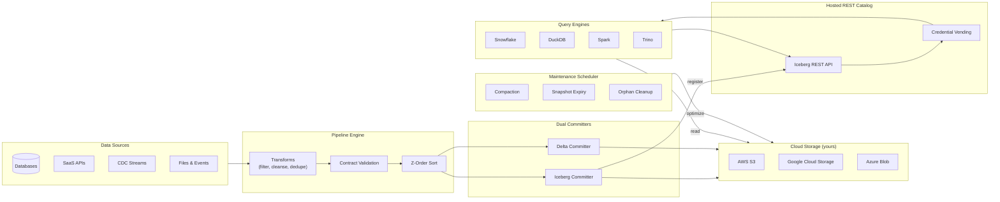

## What Is the Managed Lakehouse?

The Planasonix Managed Lakehouse lets you land pipeline data directly into open table formats — **Apache Iceberg** and **Delta Lake** — on your own cloud storage, with zero infrastructure management. Every write is dual-committed so Spark, Trino, DuckDB, and Snowflake all see consistent, queryable tables the instant a pipeline finishes.

## Feature Matrix

| Capability | Professional | Premium | Enterprise |
|---|---|---|---|
| Dual-format writes (Iceberg + Delta) | &check; | &check; | &check; |
| Cloud storage (S3, GCS, Azure) | &check; | &check; | &check; |
| Hosted Iceberg REST Catalog | 10 tables | 50 tables | Unlimited |
| Streaming micro-batch | 2 tables | 10 tables | Unlimited |
| Branches per table | 2 | 10 | Unlimited |
| Tags per table | 5 | 25 | Unlimited |
| Automated maintenance | &check; | &check; | &check; |
| Z-order sort | &check; | &check; | &check; |
| Column statistics | &check; | &check; | &check; |
| Data contract enforcement | &check; | &check; | &check; |
| Multi-catalog sync | — | 2 targets | Unlimited |
| Snapshot retention | 7 days | 30 days | 365 days |

## Getting Started

<Steps>
  <Step title="Create a connection">
    Add a **Managed Lakehouse** connection with your cloud provider credentials and catalog preference (Hosted or Glue).

    [Connection setup →](/connections/managed-lakehouse)
  </Step>
  <Step title="Build a pipeline">
    Add a Managed Lakehouse destination node, select your table name, write mode, and optional transforms.

    [Destination node →](/nodes/destinations)
  </Step>
  <Step title="Run and query">
    Execute the pipeline. Tables are auto-registered in the catalog and immediately queryable.

    [Connect your engine →](/connections/iceberg-catalog-engines)
  </Step>
</Steps>

## Guides

<CardGroup cols={2}>
  <Card title="Connection Setup" icon="plug" href="/connections/managed-lakehouse">
    Cloud provider config, Iceberg catalog, format selection
  </Card>
  <Card title="Hosted Iceberg Catalog" icon="database" href="/connections/iceberg-catalog">
    Auto-provisioned REST catalog with credential vending
  </Card>
  <Card title="Engine Connection Guides" icon="terminal" href="/connections/iceberg-catalog-engines">
    Snowflake, DuckDB, Spark, and Trino setup snippets
  </Card>
  <Card title="Table Maintenance" icon="wrench" href="/managed-lakehouse/table-maintenance">
    Compaction, snapshot expiry, orphan cleanup
  </Card>
  <Card title="Contract Enforcement" icon="shield-check" href="/managed-lakehouse/contract-enforcement">
    Validate data quality before lakehouse writes
  </Card>
  <Card title="Time Travel" icon="clock-rotate-left" href="/managed-lakehouse/time-travel">
    Browse snapshot history and preview data at any point in time
  </Card>
  <Card title="Branches & Tags" icon="code-branch" href="/managed-lakehouse/branching">
    Isolate experiments with branches, bookmark with tags
  </Card>
  <Card title="Streaming Ingestion" icon="bolt" href="/managed-lakehouse/streaming">
    Micro-batch commits for near-real-time data landing
  </Card>
  <Card title="Z-Order Sort" icon="table-cells" href="/managed-lakehouse/z-order-sort">
    Multi-dimensional clustering for query pruning
  </Card>
  <Card title="Column Statistics" icon="chart-bar" href="/managed-lakehouse/column-stats">
    Auto-computed min/max/null stats for predicate pushdown
  </Card>
  <Card title="Multi-Catalog Sync" icon="arrows-rotate" href="/managed-lakehouse/catalog-sync">
    Sync metadata to Glue, Atlas, Collibra, Alation, Unity
  </Card>
  <Card title="Table Explorer" icon="compass" href="/managed-lakehouse/table-explorer">
    Browse tables, snapshots, branches, and stats in one UI
  </Card>
</CardGroup>

## Transform-Before-Land

Apply transformations to your data before it reaches the lakehouse:

<CardGroup cols={2}>
  <Card title="Transform Guide" icon="wand-magic-sparkles" href="/nodes/managed-lakehouse-transforms">
    Filter, cleanse, dedupe, and PII-detect before writing
  </Card>
  <Card title="Z-Order Sort Node" icon="arrow-up-arrow-down" href="/nodes/z-order-sort">
    Z-order sort transform configuration
  </Card>
</CardGroup>

## API Reference

<Card title="Iceberg REST Catalog API" icon="book" href="/api-reference/iceberg-catalog">
  Full API reference for the spec-compliant Iceberg REST Catalog
</Card>
