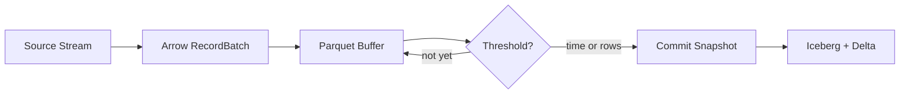

## Overview

Streaming mode enables continuous data ingestion by committing data at regular intervals instead of waiting for the entire pipeline run to complete.



## Configuration

Enable streaming mode in the Managed Lakehouse destination node:

| Setting | Default | Description |
|---------|---------|-------------|
| **Streaming Mode** | Off | Enable micro-batch commits |
| **Commit Interval** | 60 seconds | Maximum time between commits |
| **Row Limit** | 100,000 | Maximum rows before forced commit |

Whichever threshold is reached first triggers the commit.

## Backpressure

When storage upload latency increases, the system automatically reduces batch sizes to prevent memory buildup:

| Avg Commit Latency | Batch Size | Action |
|---|---|---|
| &lt; 2 seconds | 10,000 (default) | Normal operation |
| 2–5 seconds | 5,000 | Moderate backpressure |
| &gt; 5 seconds | 2,000 | Heavy backpressure, warning logged |

The engine queries the destination's `GetBackpressureProfile()` to adjust `ArrowTuning` accordingly.

## Metrics

Monitor streaming throughput in the pipeline run summary:

```json
{
  "streamingMode": true,
  "totalCommits": 42,
  "totalRows": 4200000,
  "pendingRows": 15000,
  "avgCommitLatency": "850.3ms"
}
```

## Tier Limits

| | Professional | Premium | Enterprise |
|---|---|---|---|
| Streaming tables | 2 | 10 | Unlimited |
| Min commit interval | 5 min | 1 min | 10 sec |

## Best Practices

<CardGroup cols={2}>
  <Card title="Start with 60s intervals" icon="clock">
    Begin with the default 60-second interval and adjust based on observed latency.
  </Card>
  <Card title="Monitor backpressure" icon="gauge">
    If you see batch size reductions in logs, your storage may need scaling.
  </Card>
  <Card title="Use with compaction" icon="compress">
    Streaming creates many small files. Enable compaction via table maintenance.
  </Card>
  <Card title="Arrow-native sources" icon="bolt">
    For maximum throughput, use Arrow-native sources (Kafka, Parquet) with streaming mode.
  </Card>
</CardGroup>
