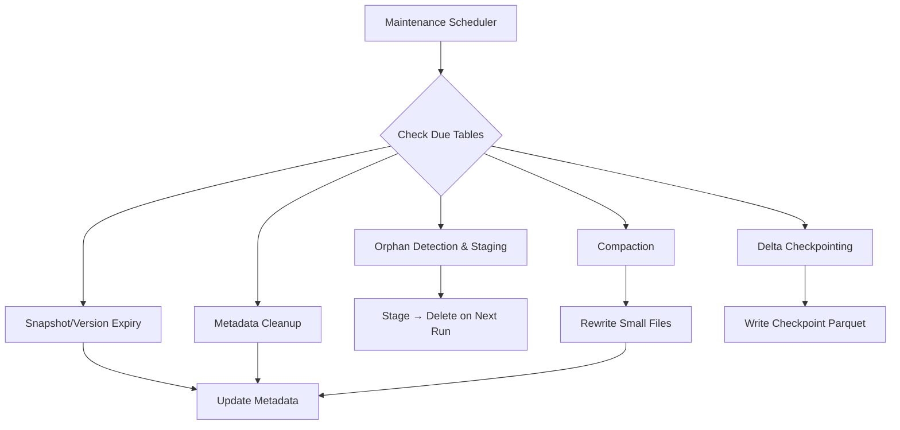

## Overview

Planasonix automatically maintains your managed lakehouse tables to ensure optimal query performance and efficient storage usage. The maintenance scheduler runs daily as a background service, executing the right operations at the right frequency.



## Operations

### Snapshot & Version Expiry (Daily)

Removes old snapshots (Iceberg) and log entries (Delta) that exceed your retention period.

- **Default retention**: 7 days
- **Safety**: Always keeps at least 2 most recent snapshots/versions
- **Iceberg**: Removes expired snapshots from metadata JSON, updates snapshot-log
- **Delta**: Deletes old `.json` log files before the 2nd-to-last checkpoint

### Orphan File Cleanup (Biweekly)

Detects and safely removes data files not referenced by any metadata.

<Steps>
  <Step title="Detect">
    Lists all files under `data/` and cross-references with Iceberg manifests and Delta log add actions.
  </Step>
  <Step title="Stage">
    Moves unreferenced files to an `orphans/` directory and creates a cleanup manifest.
  </Step>
  <Step title="Delete">
    On the next maintenance run, permanently deletes previously staged orphans.
  </Step>
</Steps>

<Note>
  The two-phase approach prevents accidental deletion of recently written files that may not yet appear in metadata.
</Note>

### Metadata Cleanup (Daily)

Keeps only the current + 3 previous metadata files:

- **Iceberg**: `.metadata.json` files in `metadata/`
- **Delta**: `.checkpoint.parquet` files in `_delta_log/`

### Parquet File Compaction (Weekly)

Rewrites small Parquet files into larger ones for better query performance.

| Setting | Default | Range |
|---------|---------|-------|
| Target Size | 128 MB | 8–1024 MB |
| Min Files | 2 | — |

**Process:**
1. Identifies Parquet files smaller than the target size
2. Reads all rows and sorts by partition columns
3. Writes new files at the target size
4. Commits to both Iceberg (new snapshot) and Delta (new log entry)
5. Refreshes column statistics (min/max, null counts) for up to 200 columns

### Delta Log Checkpointing (Every 10 Versions)

Writes a checkpoint file every 10 Delta log versions to speed up log replay for query engines.

### Delete Marker Cleanup (Daily, Delta Only)

Removes Delta `remove` actions (tombstones) older than `min(7 days, retention period)`.

## Configuration

### Per-Table Settings

Update maintenance config via API:

```bash
curl -X PUT https://api.planasonix.com/api/managed-lakehouse/tables/{id}/maintenance/config \
  -H "Authorization: Bearer flx_your_api_key" \
  -H "Content-Type: application/json" \
  -d '{
    "snapshotRetentionDays": 14,
    "compactionTargetMb": 256
  }'
```

### View Current Config

```bash
curl https://api.planasonix.com/api/managed-lakehouse/tables/{id}/maintenance/config \
  -H "Authorization: Bearer flx_your_api_key"
```

**Response:**
```json
{
  "snapshotRetentionDays": 14,
  "compactionTargetMb": 256,
  "lastMaintenanceAt": "2026-04-09T02:00:00Z",
  "nextMaintenanceAt": "2026-04-10T02:00:00Z"
}
```

## Manual Trigger

Trigger any maintenance operation on demand:

```bash
curl -X POST https://api.planasonix.com/api/managed-lakehouse/tables/{id}/maintenance \
  -H "Authorization: Bearer flx_your_api_key" \
  -H "Content-Type: application/json" \
  -d '{"operation": "compaction"}'
```

Available operations:
- `snapshot_expiry` — Expire old Iceberg snapshots
- `version_expiry` — Expire old Delta log versions (alias for Delta format)
- `orphan_cleanup` — Detect and stage/delete orphan files
- `compaction` — Compact small Parquet files
- `metadata_cleanup` — Remove old metadata files
- `delta_checkpoint` — Write Delta checkpoint
- `delete_marker_cleanup` — Clean up Delta delete markers
- `full_maintenance` — Run all operations sequentially

## Maintenance History

View past maintenance runs:

```bash
curl https://api.planasonix.com/api/managed-lakehouse/tables/{id}/maintenance/history \
  -H "Authorization: Bearer flx_your_api_key"
```

**Response:**
```json
{
  "runs": [
    {
      "id": "run-uuid",
      "operation": "compaction",
      "status": "completed",
      "filesRemoved": 0,
      "filesCompacted": 12,
      "bytesReclaimed": 52428800,
      "snapshotsExpired": 0,
      "startedAt": "2026-04-09T02:00:00Z",
      "completedAt": "2026-04-09T02:01:30Z",
      "durationMs": 90000
    }
  ]
}
```

## Scheduler Behavior

- **Frequency**: Runs every 24 hours
- **Concurrency**: Up to 4 tables maintained concurrently
- **Initial delay**: 30 seconds after server startup
- **Ordering**: Processes tables by `next_maintenance_at` (oldest first)
- **Limits**: Processes up to 100 tables per cycle

