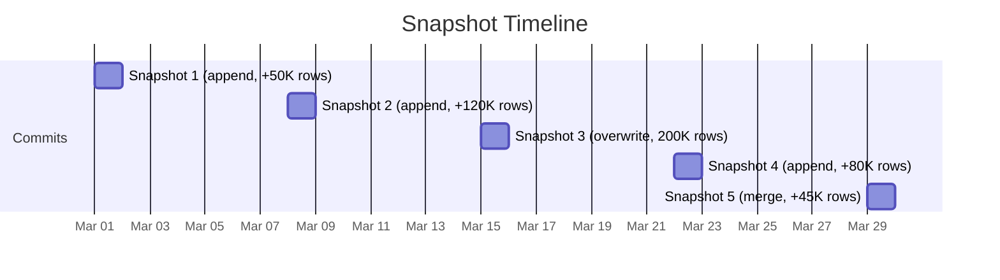

## Overview

Every commit to a managed lakehouse table creates an immutable snapshot. Time travel lets you browse the complete history of your table and inspect data at any point in time.

<Info>
Time travel is available for all managed lakehouse tables on Professional and above.
</Info>

## Snapshot Timeline

The Table Explorer's **Snapshots** tab shows a visual timeline of all commits:



- **Row counts**: How many rows were added in each commit
- **Cumulative totals**: Running total of rows and bytes at each snapshot
- **File counts**: Number of Parquet files per snapshot
- **Commit types**: Append, overwrite, or merge — color-coded

## Preview Data at a Snapshot

Click the **eye icon** on any snapshot to preview the data files at that point in time:

```
GET /api/managed-lakehouse/tables/{tableId}/preview?commit_id={commitId}&limit=50
```

The preview returns:
- Commit metadata (type, timestamp, snapshot IDs)
- List of Parquet files in the snapshot
- Total row count and file count

## Snapshot Diff

Compare two snapshots to understand what changed:

1. Click two snapshot dots on the timeline
2. Click **Compare**
3. View the diff: row delta, byte delta, file delta, and time span

```
GET /api/managed-lakehouse/tables/{tableId}/snapshots/diff?from={commitId1}&to={commitId2}
```

### Response

```json
{
  "from": { "commitId": "...", "totalRows": 50000, "totalBytes": 12000000 },
  "to": { "commitId": "...", "totalRows": 75000, "totalBytes": 18000000 },
  "diff": {
    "rowsDelta": 25000,
    "bytesDelta": 6000000,
    "filesDelta": 5,
    "timeDelta": "2h30m"
  }
}
```

## Retention

Snapshot retention is configurable per table:

| Tier | Default Retention |
|------|------------------|
| Professional | 7 days |
| Premium | 30 days |
| Enterprise | Up to 365 days |

Expired snapshots are removed by the [maintenance scheduler](/managed-lakehouse/table-maintenance).

## API Reference

<ParamField path="tableId" type="string" required>
  The managed lakehouse table ID
</ParamField>

### List Snapshots

```
GET /api/managed-lakehouse/tables/{tableId}/snapshots
```

### Preview at Snapshot

```
GET /api/managed-lakehouse/tables/{tableId}/preview?commit_id={commitId}&limit=50
```

### Diff Two Snapshots

```
GET /api/managed-lakehouse/tables/{tableId}/snapshots/diff?from={id1}&to={id2}
```

