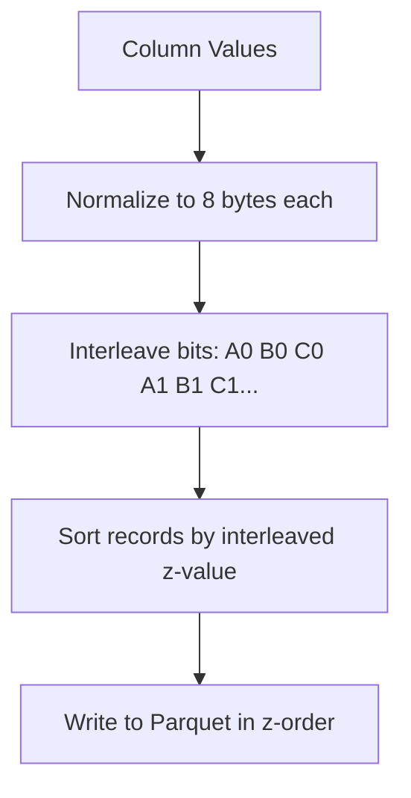

## Overview

Z-order sorting interleaves the bits of multiple columns to achieve multi-dimensional data locality. This dramatically improves query performance when filters span multiple columns.

## When to Use Z-Order

Z-order is ideal when your queries frequently filter on **2 or more columns simultaneously**:

```sql
-- Queries that benefit from z-order on (region, date):
SELECT * FROM events WHERE region = 'US' AND date > '2026-01-01';
SELECT * FROM orders WHERE customer_id = 123 AND status = 'pending';
```

Without z-order, data is sorted by one column, forcing full scans on the other. With z-order, data locality exists across all chosen dimensions.

## How It Works



1. **Normalize**: Each column value is converted to an 8-byte comparable representation
2. **Interleave**: Bits from all columns are woven together
3. **Sort**: Records are sorted by the interleaved value
4. **Write**: Parquet files preserve the z-order, creating natural clustering

## Configuration

In the Managed Lakehouse destination node:

1. Set **Sort Strategy** to "Z-Order"
2. Enter columns: `region, date, user_id`

Or via pipeline JSON:

```json
{
  "managedLakehouseSettings": {
    "sortStrategy": "z_order",
    "sortColumns": ["region", "date", "user_id"]
  }
}
```

## Supported Column Types

| Type | Normalization |
|------|-------------|
| `int`, `int32`, `int64` | Sign-bit flip for unsigned comparison |
| `float32`, `float64` | IEEE 754 total-order encoding |
| `timestamp`, `date` | Microseconds since epoch |
| `string` | First 8 bytes for locality |
| `boolean` | 0 or 1 |

## Tips

<Warning>
Don't z-order by columns that are already partition keys — they're already isolated into separate directories.
</Warning>

- Choose **2–4 columns** that are most frequently used together in WHERE clauses
- Timestamp columns are excellent z-order candidates
- Z-order is applied per batch; [compaction](/managed-lakehouse/table-maintenance) further improves clustering over time
- For single-column queries, standard sort order is sufficient — z-order helps with multi-column patterns
