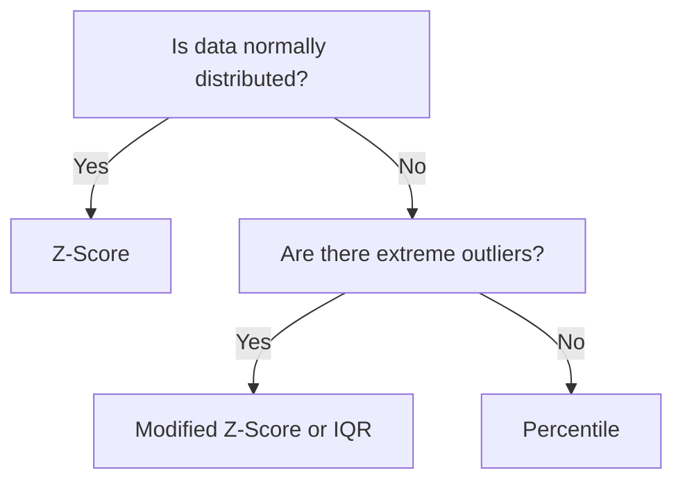

## Overview

The Anomaly Detection transform identifies statistical outliers in numeric data columns. It supports multiple detection methods and configurable actions — from flagging anomalies for review to automatically removing or capping them. Available on **Professional** plans and above.

## Detection Methods

| Method | Algorithm | Best For |
|---|---|---|
| **Z-Score** | Measures standard deviations from the mean | Normally distributed data |
| **IQR** | Uses Q1/Q3 interquartile range boundaries | Skewed distributions, robust to extreme outliers |
| **Percentile** | Flags values outside a percentile range | General-purpose without distribution assumptions |
| **Modified Z-Score** | Uses median absolute deviation (MAD) | Data with extreme outliers that distort the mean |

### Method Selection Guide



## Configuration

| Field | Description | Default |
|---|---|---|
| **Columns** | Numeric columns to analyze for anomalies | (required) |
| **Method** | Statistical detection algorithm | Z-Score |
| **Threshold** | Sensitivity level (method-dependent, see below) | 3.0 |
| **Window Size** | Number of recent rows for rolling statistics | All rows |

### Threshold Interpretation

| Method | Threshold Meaning | Typical Values |
|---|---|---|
| **Z-Score** | Number of standard deviations | 2.0 (95%), 3.0 (99.7%) |
| **IQR** | Multiplier of the interquartile range | 1.5 (standard), 3.0 (extreme only) |
| **Percentile** | Upper and lower percentile bounds | 1.0 and 99.0 |
| **Modified Z-Score** | MAD-based deviation threshold | 3.5 (recommended) |

## Actions

| Action | Behavior |
|---|---|
| **Flag** | Adds a boolean column (`_anomaly = true`) to anomalous rows |
| **Remove** | Drops anomalous rows from the output |
| **Cap** | Clamps anomalous values to the boundary thresholds |
| **Replace** | Sets anomalous values to NULL |

<Tip>
  Start with the **Flag** action to review detected anomalies before committing to removal or capping. Switch to a destructive action only after confirming the detection method and threshold match your data.
</Tip>

## Examples

### Financial Data Quality

Flag transactions with extreme amounts before loading to the warehouse:

```
Transactions Source → Anomaly Detection [amount, Z-Score, threshold=3.0, Flag] → Warehouse
```

Query flagged rows:
```sql
SELECT * FROM transactions WHERE amount_anomaly = true;
```

### Sensor Data Cleaning

Cap extreme sensor readings to prevent dashboard spikes:

```
IoT Source → Anomaly Detection [temperature, IQR, threshold=1.5, Cap] → Time-Series DB
```

### Rolling Window Detection

Detect anomalies based on recent trends rather than all-time statistics:

```
Metrics Source → Anomaly Detection [latency_ms, Z-Score, window=1000] → Alert
```

## Pipeline Patterns

### Review-then-Clean

```
Source → Anomaly Detection [Flag] → Filter (keep anomalies) → Review Table
Source → Anomaly Detection [Flag] → Filter (remove anomalies) → Production Table
```

### Multi-Column Analysis

Apply detection to multiple numeric columns in one node:

```
Source → Anomaly Detection [price, quantity, discount — IQR, threshold=1.5] → Destination
```

## Tips

- **Z-Score** assumes normally distributed data — verify with Data Profiling first
- **IQR** is more robust to extreme outliers than Z-Score because it uses quartiles rather than mean
- **Lower thresholds** flag more anomalies (higher sensitivity, more false positives)
- **Window Size** enables rolling statistics — useful for time-series data where the distribution shifts over time
- Combine with **Validation** nodes for comprehensive quality: Anomaly Detection catches statistical outliers while Validation catches rule-based violations

## Related

<CardGroup cols={2}>
  <Card title="Data Quality Nodes" icon="circle-check" href="/nodes/data-quality">
    All data quality transforms including validation and profiling
  </Card>
  <Card title="Data Contracts" icon="shield" href="/governance/data-contracts">
    Rule-based validation at the contract level
  </Card>
  <Card title="Observability" icon="gauge" href="/observability/overview">
    Monitor anomaly rates across pipeline runs
  </Card>
  <Card title="Column Transforms" icon="table-columns" href="/nodes/column-transforms">
    Additional column-level operations
  </Card>
</CardGroup>
