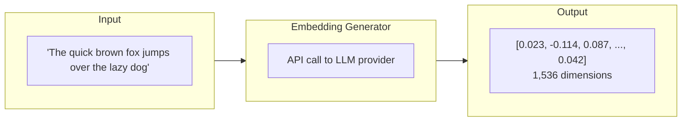

## Overview

The Embedding Generator transform produces vector embeddings from text columns using a connected AI/LLM provider. Embeddings convert human-readable text into dense numeric vectors that capture semantic meaning, enabling similarity search, clustering, deduplication, and ML feature engineering. Available on **Professional** plans and above.

## When to Use

- **Semantic search**: Store embeddings in a vector database for similarity queries
- **Deduplication**: Find semantically similar records even with different wording
- **Clustering**: Group similar text records (support tickets, product descriptions)
- **Recommendation**: Find similar products, articles, or customers
- **Classification**: Use embeddings as ML input features

## Configuration

| Field | Description | Default |
|---|---|---|
| **Source Column** | Text column to generate embeddings from | (required) |
| **Output Column** | Name for the resulting embedding vector column | `embedding` |
| **Model** | Embedding model to use | (required) |
| **Dimensions** | Vector dimensionality (model-dependent) | Model default |
| **API Endpoint** | Provider endpoint (auto-filled from connection) | Connection default |
| **API Key** | Provider API key (auto-filled from connection) | Connection default |

## Supported Models

| Provider | Model | Dimensions | Notes |
|---|---|---|---|
| **OpenAI** | text-embedding-3-small | 1,536 | Cost-effective, good quality |
| **OpenAI** | text-embedding-3-large | 3,072 | Highest quality, higher cost |
| **Google** | text-embedding-004 | 768 | Google Cloud integration |

<Info>
  The model list depends on your connected AI provider. Connect an [AI provider](/connections/ai-providers) first, then select the model in the node configuration.
</Info>

## How It Works



Each text value is sent to the configured embedding API. The response vector is stored in the output column as a numeric array.

## Example

### Input

| id | description |
|---|---|
| 1 | "Wireless bluetooth headphones with noise cancellation" |
| 2 | "Premium over-ear headset with ANC technology" |
| 3 | "USB-C charging cable, 6 feet" |

### Output

| id | description | embedding |
|---|---|---|
| 1 | "Wireless bluetooth..." | [0.023, -0.114, 0.087, ...] |
| 2 | "Premium over-ear..." | [0.021, -0.118, 0.091, ...] |
| 3 | "USB-C charging..." | [-0.156, 0.043, -0.022, ...] |

Products 1 and 2 have similar embedding vectors (both are headphones) while product 3 is distant.

## Pipeline Patterns

### Semantic Search Pipeline

```
Product Catalog → Embedding Generator → Vector Database Write
```

### Deduplication Pipeline

```
Support Tickets → Embedding Generator → Similarity Join (cosine) → Flag Duplicates
```

### ML Feature Engineering

```
User Reviews → Embedding Generator → Join with User Profile → ML Training Dataset
```

## Cost and Performance

| Consideration | Guidance |
|---|---|
| **API costs** | Costs apply per token — use **Sample** upstream during development |
| **Latency** | Each row requires an API call; batch sizes are optimized automatically |
| **Caching** | Embeddings are deterministic — cache results to avoid re-generating for unchanged text |
| **Text length** | Longer text may need chunking; most models have a token limit (8,192 tokens for OpenAI) |
| **Rate limits** | Provider rate limits apply; the node automatically handles retries and backoff |

<Warning>
  Never send unreviewed PII through embedding APIs without policy approval. Use **PII Detection** upstream to identify and mask sensitive fields.
</Warning>

## Tips

- **Store embeddings efficiently**: Use a column type that supports arrays or JSON; for vector databases, use their native vector type
- **Chunk long text**: If text exceeds the model's token limit, split into overlapping chunks and embed each separately
- **Normalize vectors**: Some similarity search engines expect unit-normalized vectors — check your destination's requirements
- **Version your model**: Embedding vectors from different models are not comparable — document which model generated each embedding

## Related

<CardGroup cols={2}>
  <Card title="AI Provider Connections" icon="microchip" href="/connections/ai-providers">
    Connect OpenAI, Google AI, or Anthropic
  </Card>
  <Card title="LLM Transform" icon="robot" href="/nodes/advanced#llm-transform-enterprise">
    Generate text with prompts using LLM models
  </Card>
  <Card title="Advanced Nodes" icon="microchip" href="/nodes/advanced">
    All advanced transform nodes
  </Card>
  <Card title="PII Detection" icon="shield" href="/nodes/data-quality#pii-detection">
    Protect sensitive data before sending to external APIs
  </Card>
</CardGroup>
