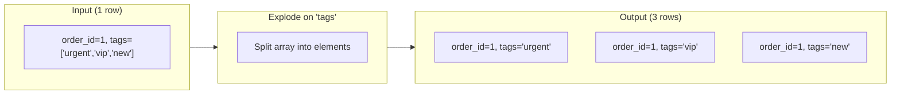

## Overview

The Explode transform takes array-valued columns and produces one output row per array element. Non-array columns are duplicated on each output row. This is the standard way to unnest arrays from JSON payloads, event batches, or document stores into the flat row shape required by joins, aggregations, and relational destinations.

## When to Use

- After JSON sources that deliver arrays of items (e.g. `line_items`, `tags`, `events`)
- When you need to aggregate, filter, or join on individual array elements
- Before writing to relational databases that expect one row per entity

<Warning>
  Explode **multiplies row count** — one input row with an array of N elements produces N output rows. Place **Filter** before Explode when possible to limit the expansion.
</Warning>

## How It Works



### Example

**Input:**

| order_id | customer | items |
|---|---|---|
| 1 | Alice | ["widget", "gadget"] |
| 2 | Bob | ["tool"] |

**Output (explode on `items`):**

| order_id | customer | items |
|---|---|---|
| 1 | Alice | widget |
| 2 | Alice | gadget |
| 2 | Bob | tool |

## Configuration

| Field | Description | Default |
|---|---|---|
| **Explode Column** | The array column to expand into rows | (required) |

## Pipeline Patterns

### E-commerce Line Items

```
Orders API → JSON Parser → Explode (line_items) → Aggregate (revenue per product) → Warehouse
```

### Event Tags Analysis

```
Events Source → Explode (tags) → Group By tag → Dashboard
```

### Combined with Flatten

When data has both nested objects and arrays:

```
Source → Flatten (nested objects) → Explode (arrays) → Destination
```

## Handling Edge Cases

| Input Array | Output |
|---|---|
| `["a", "b", "c"]` | 3 rows |
| `[]` (empty array) | Row is dropped (no elements to emit) |
| `null` | Row is dropped |
| `"not an array"` | Row passes through unchanged |

## Tips

- **Empty arrays** produce zero output rows for that input row — if you need to preserve such rows, add a default array value upstream
- **Nested arrays** (arrays of arrays) require chaining multiple Explode nodes
- **Performance**: Explode on high-cardinality arrays (hundreds of elements per row) can significantly increase dataset size — monitor row counts in the pipeline run summary
- **Combine with Unique**: After Explode, duplicates may appear if the same element exists in multiple source rows — use Unique if needed

## Related

<CardGroup cols={2}>
  <Card title="Flatten" icon="bars-staggered" href="/nodes/flatten">
    Flatten nested objects into columns
  </Card>
  <Card title="Row Transforms" icon="filter" href="/nodes/row-transforms">
    Filter, sort, and deduplicate after exploding
  </Card>
  <Card title="Aggregation" icon="chart-column" href="/nodes/aggregation">
    Aggregate per-element after exploding arrays
  </Card>
  <Card title="JSON Parser" icon="file-code" href="/nodes/parsers-and-builders">
    Parse raw JSON before exploding
  </Card>
</CardGroup>
