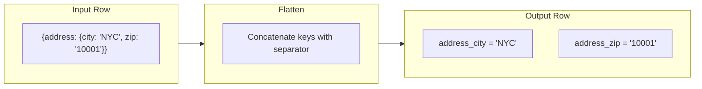

## Overview

The Flatten transform takes nested JSON objects and expands them into flat columns by concatenating parent and child key names with a configurable separator. This is essential for converting hierarchical API responses or document-store records into the tabular shape that joins, aggregations, and warehouse writes expect.

## When to Use

- After **JSON Parser** or **REST API** sources that return deeply nested objects
- When you need to join on fields buried inside nested structures
- Before writing to SQL databases or warehouses that require flat schemas
- When nested depth varies and you need a consistent column layout

<Info>
  For **array** columns, use the [Explode](/nodes/explode) node instead. Flatten handles objects (key-value structures); Explode handles arrays (ordered lists).
</Info>

## How It Works



### Nested Example

Given this input:

```json
{
  "user": {
    "name": "Alice",
    "address": {
      "city": "NYC",
      "state": "NY"
    }
  },
  "total": 99.50
}
```

With separator `_` and max depth `0` (unlimited), the output is:

| user_name | user_address_city | user_address_state | total |
|---|---|---|---|
| Alice | NYC | NY | 99.50 |

## Configuration

| Field | Description | Default |
|---|---|---|
| **Source Column** | The column containing nested objects to flatten | (required) |
| **Separator** | Character between parent and child key names | `_` |
| **Max Depth** | Maximum nesting levels to flatten (0 = unlimited) | 0 |

### Max Depth Behavior

| Max Depth | Input `{a: {b: {c: 1}}}` | Output |
|---|---|---|
| 0 (unlimited) | Full flatten | `a_b_c = 1` |
| 1 | One level | `a_b = {"c": 1}` (inner object stays as JSON) |
| 2 | Two levels | `a_b_c = 1` |

## Pipeline Patterns

### REST API Normalization

```
REST API Source → JSON Parser → Flatten → Schema Mapping → Warehouse Write
```

### Nested Event Processing

```
Webhook Source → Flatten (depth=1) → Filter → Destination
```

### Combined with Explode

When data has both nested objects and arrays:

```
Source → Flatten (objects) → Explode (arrays) → Destination
```

## Tips

- **Separator collisions**: If parent and child keys combine to match an existing column name, the flattened column takes precedence. Use a unique separator like `__` to avoid conflicts.
- **Large objects**: Deeply nested objects with many keys can produce a wide schema. Use **Max Depth** to limit expansion.
- **Chain multiple Flatten nodes**: For selective flattening, apply Flatten to specific columns one at a time rather than flattening everything at once.

## Related

<CardGroup cols={2}>
  <Card title="Explode" icon="arrows-split-up-and-left" href="/nodes/explode">
    Expand array columns into separate rows
  </Card>
  <Card title="JSON Parser" icon="file-code" href="/nodes/parsers-and-builders">
    Parse raw JSON strings into objects first
  </Card>
  <Card title="Parsers and Builders" icon="code" href="/nodes/parsers-and-builders">
    All parser and builder nodes
  </Card>
  <Card title="Column Transforms" icon="table-columns" href="/nodes/column-transforms">
    Further column-level operations after flattening
  </Card>
</CardGroup>
