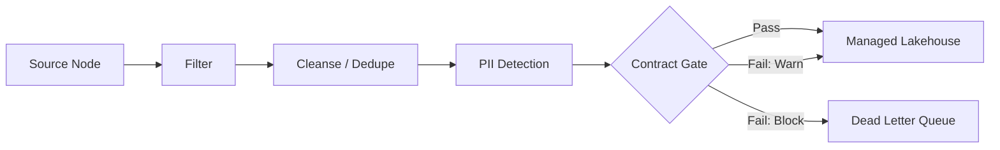

## Overview

The Managed Lakehouse destination works best when data is cleaned, validated, and shaped before it lands. This guide covers the recommended transform pipeline and how contract enforcement gates data quality at the write boundary.



## Recommended Transforms

### 1. Filter

Remove rows that should never reach the lakehouse — test records, internal traffic, incomplete events.

```json
{
  "type": "filter",
  "condition": "environment != 'test' AND user_id IS NOT NULL"
}
```

<Tip>
  Filtering early reduces the volume of data flowing through downstream transforms and into storage.
</Tip>

### 2. Cleanse

Standardize formats, trim whitespace, normalize casing, and coerce types before writing to Parquet.

| Transform | Example |
|---|---|
| Trim whitespace | `"  John "` → `"John"` |
| Normalize email | `"USER@Example.COM"` → `"user@example.com"` |
| Coerce types | `"123"` → `123` (string to integer) |
| Default nulls | `NULL` → `"unknown"` for required string fields |

### 3. Deduplicate

Remove duplicate records within a batch using a deduplication key:

```json
{
  "type": "deduplicate",
  "keys": ["event_id"],
  "strategy": "keep_first"
}
```

### 4. PII Detection

Identify and mask personally identifiable information before landing in the lakehouse:

- Hash email addresses and phone numbers
- Redact free-text fields containing detected PII
- Tag columns with sensitivity classifications

### 5. Contract Validation

Assign a [data contract](/governance/data-contracts) to the Managed Lakehouse node to validate every record before writing. See the [contract enforcement guide](/managed-lakehouse/contract-enforcement) for full details.

## Contract Enforcement at the Write Boundary

When a contract is assigned to a Managed Lakehouse destination:

| Mode | Valid Records | Invalid Records |
|---|---|---|
| **Warn** | Written to lakehouse | Written to lakehouse + violations logged |
| **Block** | Written to lakehouse | Routed to [Dead Letter Queue](/observability/dead-letter-queue) |

### What's Validated

- **Schema**: Column names, types, nullability
- **Value rules**: Range checks, enum membership, regex patterns
- **Freshness**: Timestamp recency constraints

### Violation Tracking

Violations appear in two places:

1. **Data Contracts page** — full violation history with sample data
2. **Pipeline run summary** — violation count badge on the destination node

In `block` mode, rejected records appear in the **DLQ** page with error code `CONTRACT_VIOLATION`, including the original payload and the specific rule that failed.

## DLQ Routing for Failed Records

When contract enforcement is in `block` mode:

1. The destination splits each batch into valid and invalid records
2. Valid records are committed to the lakehouse
3. Invalid records are written to the DLQ with:
   - Original record payload
   - Contract ID and version
   - Failed rule name and expected vs actual values
   - Pipeline run ID for traceability

You can then [triage and reprocess](/observability/dead-letter-queue) DLQ entries after fixing the upstream data or relaxing the contract rule.

## Pipeline Templates

A prebuilt pipeline template is available in the **Template Library**:

**Source → Contract → Lakehouse**

This template provides:
- Pre-configured source extraction
- Data contract validation node
- Managed Lakehouse destination with recommended settings
- Automatic partition strategy via the [Partition Advisor](/managed-lakehouse/contract-enforcement#partition-advisor)

## Ordering Transforms

Place transforms in this order for optimal results:

| Order | Transform | Why |
|---|---|---|
| 1 | Filter | Reduce volume early |
| 2 | Cleanse / type coercion | Normalize before validation |
| 3 | Deduplicate | Remove duplicates before contract check |
| 4 | PII detection / masking | Protect sensitive data before storage |
| 5 | Contract validation | Final quality gate |
| 6 | Z-order sort | Applied automatically at the destination |

## Related

<CardGroup cols={2}>
  <Card title="Contract Enforcement" icon="shield-check" href="/managed-lakehouse/contract-enforcement">
    Full guide to contract configuration and partition advisor
  </Card>
  <Card title="Dead Letter Queue" icon="inbox" href="/observability/dead-letter-queue">
    Triage and reprocess contract-failed records
  </Card>
  <Card title="Z-Order Sort" icon="arrow-up-arrow-down" href="/nodes/z-order-sort">
    Multi-dimensional sort applied at the destination
  </Card>
  <Card title="Data Quality Nodes" icon="check-double" href="/nodes/data-quality">
    General data quality transforms
  </Card>
</CardGroup>
