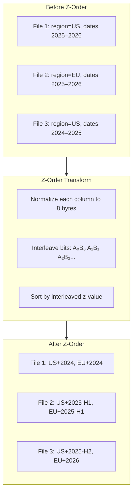

## Overview

The Z-Order Sort transform reorders records by interleaving the bits of multiple column values, producing a space-filling curve that preserves multi-dimensional locality. The result: query engines can skip far more data files when filtering on any combination of the chosen columns.

## When to Use

Use Z-Order Sort when your downstream queries frequently filter on **two or more columns simultaneously**:

```sql
SELECT * FROM events
WHERE region = 'US' AND event_date > '2026-01-01';

SELECT * FROM orders
WHERE customer_id = 123 AND status = 'pending';
```

Without z-ordering, data is sorted by a single column — filters on other columns force full scans. Z-ordering distributes locality across all chosen dimensions.

<Warning>
Do not z-order by columns that are already **partition keys**. Partitioned columns are already isolated into separate directories and z-ordering them wastes CPU without improving pruning.
</Warning>

## How It Works



1. **Normalize** — Each column value is converted to an 8-byte comparable representation (sign-bit flip for integers, IEEE 754 encoding for floats, epoch microseconds for timestamps, first 8 bytes for strings)
2. **Interleave** — Bits from all columns are woven together: `A[0] B[0] C[0] A[1] B[1] C[1] ...`
3. **Sort** — Records are sorted by the composite z-value
4. **Write** — Parquet files preserve the z-order, creating natural multi-dimensional clustering

## Configuration

Z-Order Sort can be configured in two ways:

### Option A: Standalone Transform Node

Drag the **Z-Order Sort** node from the **Row Transforms** section of the sidebar onto the canvas. Place it before any destination node.

1. Connect the upstream transform output to the Z-Order Sort node
2. In the config panel, enter the **columns** to z-order (e.g. `region, event_date, user_id`)
3. Connect the Z-Order Sort output to the destination node

This option works with any destination, not just Managed Lakehouse.

### Option B: Managed Lakehouse Destination Setting

The Managed Lakehouse destination has a built-in sort strategy:

1. Open the Managed Lakehouse destination node settings
2. Scroll to **Sort Strategy** and select **Z-Order**
3. Enter the columns to z-order: `region, event_date, user_id`

### Pipeline JSON

```json
// Standalone node
{
  "type": "z_order_sort",
  "columns": ["region", "event_date", "user_id"]
}

// Or as a destination setting
{
  "managedLakehouseSettings": {
    "sortStrategy": "z_order",
    "sortColumns": ["region", "event_date", "user_id"]
  }
}
```

<Info>
  When using both a standalone Z-Order Sort node **and** the Managed Lakehouse sort strategy, the standalone node's sort is applied first. The destination setting is redundant in this case — use one or the other.
</Info>

## Supported Column Types

| Type | Normalization | Notes |
|---|---|---|
| `int`, `int32`, `int64` | Sign-bit flip | Preserves total order for signed integers |
| `float32`, `float64` | IEEE 754 total-order encoding | Handles NaN and negative zero correctly |
| `timestamp`, `date` | Microseconds since epoch | Timezone-normalized before encoding |
| `string` | First 8 bytes | Provides locality for short prefixes |
| `boolean` | 0 or 1 | Binary columns contribute 1 bit per level |

## Buffering Behavior

The Z-Order Sort is a **buffering transform** — it must see all records in the batch before producing sorted output. During a pipeline run:

1. Records accumulate in the transform's internal buffer via `Apply()`
2. At flush time, `GetRecords()` returns all records sorted by z-value
3. The sorted batch is written to Parquet in one pass

For streaming mode, each micro-batch is z-ordered independently.

## Column Selection Tips

- **2–4 columns** is the sweet spot. More columns dilute the locality benefit of each individual column.
- **Timestamp columns** are excellent candidates — they provide natural range-based locality.
- **High-cardinality columns** (IDs, hashes) benefit from bucketing as a partition strategy instead.
- **Low-cardinality columns** (enums, booleans) contribute fewer bits and should be supplemented with higher-cardinality columns.

## Performance Impact

Z-ordering adds CPU cost during writes (normalization + sort) but significantly reduces I/O during reads:

| Scenario | Without Z-Order | With Z-Order |
|---|---|---|
| 2-column filter scan | ~100% of files read | ~15–30% of files read |
| 3-column filter scan | ~100% of files read | ~10–25% of files read |
| Write overhead | Baseline | +5–15% CPU |

<Tip>
  Combine z-order with [compaction](/managed-lakehouse/table-maintenance) for best results. Compaction merges small files and re-sorts across batches, achieving global z-order across the full table.
</Tip>

## Related

<CardGroup cols={2}>
  <Card title="Z-Order Overview" icon="table-cells" href="/managed-lakehouse/z-order-sort">
    Concept overview and when to use z-ordering
  </Card>
  <Card title="Column Statistics" icon="chart-bar" href="/managed-lakehouse/column-stats">
    Z-ordered data produces tighter min/max bounds per file
  </Card>
  <Card title="Table Maintenance" icon="wrench" href="/managed-lakehouse/table-maintenance">
    Compaction achieves global z-order across batches
  </Card>
  <Card title="Transform-Before-Land" icon="wand-magic-sparkles" href="/nodes/managed-lakehouse-transforms">
    Other transforms to apply before lakehouse writes
  </Card>
</CardGroup>
