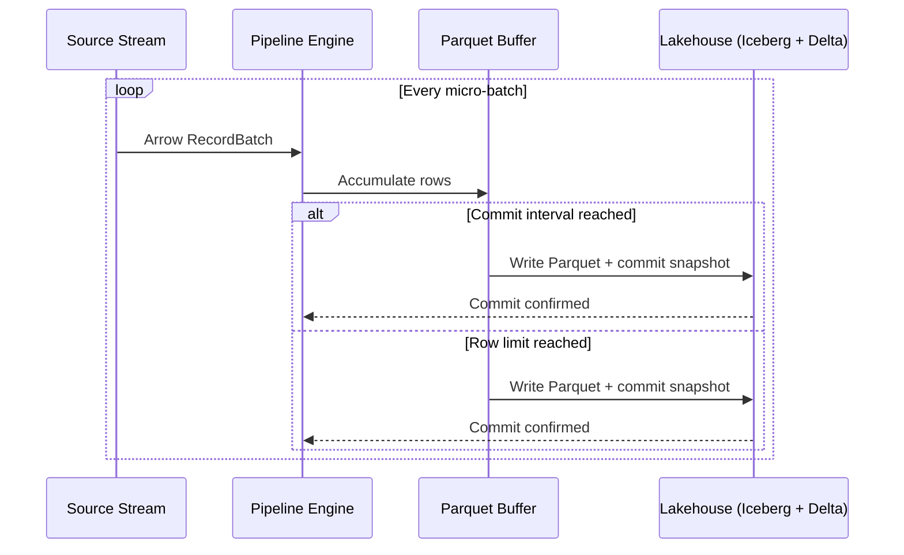

## Overview

Streaming lake ingestion enables **continuous, near-real-time data landing** into managed lakehouse tables. Instead of waiting for a pipeline run to complete, the destination commits data at configurable intervals — creating a new Iceberg snapshot and Delta version with each micro-batch.



## How It Works

In streaming mode, two thresholds govern when a commit occurs:

| Threshold | Default | Description |
|---|---|---|
| **Commit interval** | 60 seconds | Maximum wall-clock time between commits |
| **Row limit** | 100,000 rows | Maximum rows buffered before forced commit |

Whichever threshold is reached first triggers the commit. Each commit:

1. Flushes the Parquet buffer to cloud storage
2. Creates an Iceberg snapshot with manifest entries
3. Creates a Delta log version with `add` actions
4. Resets the buffer and timers

## Arrow-Native Path

For maximum throughput, streaming mode operates on **Arrow RecordBatches** directly — avoiding row-by-row serialization. Sources that emit Arrow natively (Kafka with Arrow encoding, Parquet files, JDBC Arrow flight) skip the intermediate record conversion entirely.

## Configuration

Enable streaming in the Managed Lakehouse destination node settings:

1. Expand **Advanced Settings**
2. Toggle **Streaming micro-batch mode** on
3. Set the **Commit interval** (seconds)
4. Set the **Row limit**

Or via pipeline JSON:

```json
{
  "managedLakehouseSettings": {
    "streamingMode": true,
    "streamingCommitInterval": 60,
    "streamingCommitRowLimit": 100000
  }
}
```

## Backpressure

When storage upload latency increases — due to network congestion, throttling, or large batches — the engine automatically reduces batch sizes to prevent memory pressure:

| Avg Commit Latency | Batch Size | Action |
|---|---|---|
| < 2 seconds | 10,000 (default) | Normal operation |
| 2–5 seconds | 5,000 | Moderate backpressure — halved batch |
| > 5 seconds | 2,000 | Heavy backpressure — warning logged |

The `GetBackpressureProfile()` method on the destination provides these signals to the pipeline engine, which adjusts `ArrowTuning` accordingly.

## Monitoring

### Pipeline Run Summary

Streaming metrics appear in the run summary:

```json
{
  "streamingMode": true,
  "totalCommits": 42,
  "totalRows": 4200000,
  "pendingRows": 15000,
  "avgCommitLatency": "850.3ms"
}
```

### Key Metrics

| Metric | What It Tells You |
|---|---|
| `totalCommits` | Total micro-batch commits during the run |
| `totalRows` | Total rows written across all commits |
| `pendingRows` | Rows currently buffered awaiting the next commit |
| `avgCommitLatency` | Average time per commit (write + catalog update) |

<Warning>
  If `avgCommitLatency` consistently exceeds 5 seconds, consider increasing the commit interval or scaling your storage throughput.
</Warning>

## Interaction with Other Features

### Compaction

Streaming creates many small Parquet files. The [maintenance scheduler](/managed-lakehouse/table-maintenance) automatically compacts these into larger files during the weekly compaction cycle. For high-throughput tables, consider triggering manual compaction more frequently.

### Z-Order Sort

When z-order sort is configured alongside streaming mode, each micro-batch is z-ordered independently before writing. Global z-ordering across batches is achieved through compaction.

### Data Contracts

Contract validation runs on every micro-batch. In `block` mode, invalid records from each batch are routed to the DLQ, and only valid records are committed.

## Tier Limits

| | Professional | Premium | Enterprise |
|---|---|---|---|
| Streaming tables | 2 | 10 | Unlimited |
| Min commit interval | 5 min | 1 min | 10 sec |

## Best Practices

<CardGroup cols={2}>
  <Card title="Start conservative" icon="gauge">
    Begin with 60-second intervals and adjust based on observed latency and downstream freshness requirements.
  </Card>
  <Card title="Watch memory" icon="memory">
    If the row limit is very high, each buffered batch consumes memory. Balance between commit frequency and memory usage.
  </Card>
  <Card title="Enable compaction" icon="compress">
    Streaming generates many small files. Ensure table maintenance is enabled for automatic compaction.
  </Card>
  <Card title="Arrow-native sources" icon="bolt">
    Pair streaming with Arrow-native sources (Kafka, Parquet) for the highest throughput.
  </Card>
</CardGroup>

## Related

<CardGroup cols={2}>
  <Card title="Table Maintenance" icon="wrench" href="/managed-lakehouse/table-maintenance">
    Compaction optimizes small files from streaming
  </Card>
  <Card title="Streaming overview" icon="wave-pulse" href="/streaming/overview">
    General streaming and CDC capabilities
  </Card>
</CardGroup>
